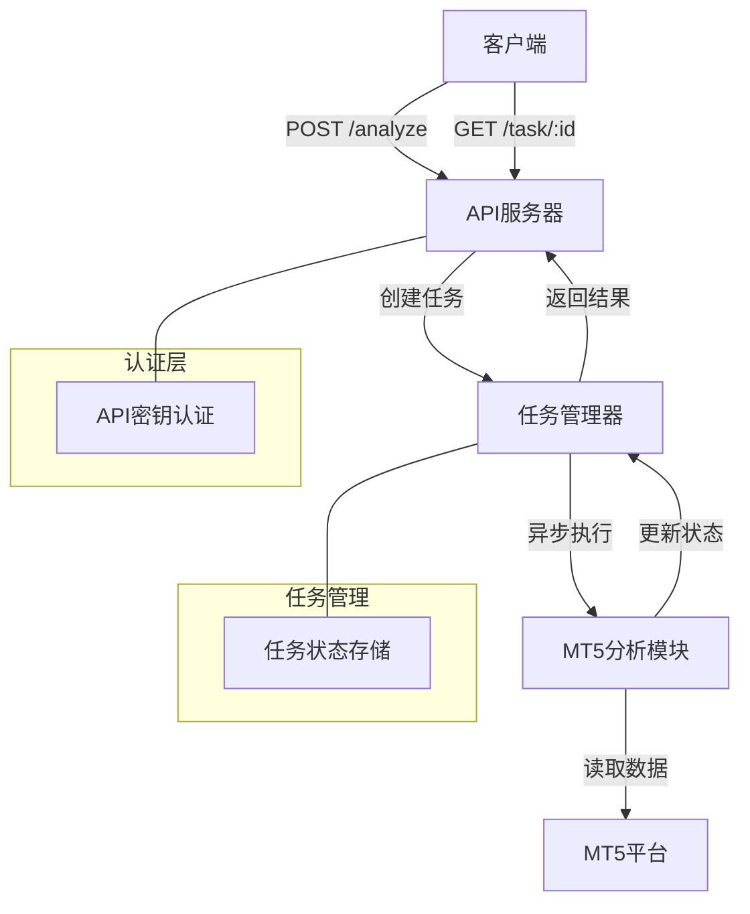

# MT5 Trade Analysis API Server

这是一个基于 Flask 的 HTTP 服务器，用于异步执行 MetaTrader 5 (MT5) 交易数据分析任务。该服务器提供了 RESTful API 接口，支持任务状态追踪和API密钥认证。

## 系统架构



## 主要功能

1. **API 认证**
   - 使用 API 密钥进行请求认证
   - 所有接口都需要在请求头中包含有效的 `x-api-key`

2. **异步任务处理**
   - 支持长时间运行的分析任务
   - 通过任务 ID 追踪任务状态
   - 任务状态实时更新

3. **MT5 数据分析**
   - 连接 MT5 平台获取交易数据
   - 执行交易数据分析
   - 生成分析报告

4. **状态追踪**
   - 任务创建时间记录
   - 任务完成时间记录
   - 错误处理和状态报告

## 安装说明

### 前置条件

- Python 3.7+
- MetaTrader 5 平台
- MT5 Python 包

### 安装步骤

1. 克隆代码库：
```bash
git clone <repository-url>
cd <repository-directory>
```

2. 创建虚拟环境（推荐）：
```bash
python -m venv venv
source venv/bin/activate  # Linux/Mac
venv\Scripts\activate     # Windows
```

3. 安装依赖：
```bash
pip install -r requirements.txt
```

### 依赖包列表
```
flask
MetaTrader5
pandas
pytz
```

## 使用说明

### 启动服务器

```bash
python mt5_api_server.py
```
服务器默认在 `0.0.0.0:5000` 启动。

### API 接口

1. **启动分析任务**
```bash
curl -X POST http://localhost:5000/analyze -H "x-api-key: mysecret"
```

响应示例：
```json
{
    "task_id": "550e8400-e29b-41d4-a716-446655440000",
    "status": "running"
}
```

2. **查询任务状态**
```bash
curl http://localhost:5000/task/<task_id> -H "x-api-key: mysecret"
```

响应示例：
```json
{
    "status": "completed",
    "created_at": "2024-01-01T12:00:00+00:00",
    "completed_at": "2024-01-01T12:01:00+00:00"
}
```

### 任务状态说明

- `running`: 任务正在执行中
- `completed`: 任务已成功完成
- `failed`: 任务执行失败（包含错误信息）

## 注意事项

1. **安全性**
   - 请妥善保管 API 密钥
   - 建议在生产环境中使用更强的认证机制
   - 建议使用 HTTPS 进行通信

2. **性能考虑**
   - 服务器使用内存存储任务状态，重启后状态会丢失
   - 长时间运行可能需要考虑内存管理
   - 建议定期清理旧的任务状态

3. **MT5 连接**
   - 确保 MT5 平台已经启动并登录
   - 检查 MT5 API 访问权限
   - 注意处理网络连接问题

4. **错误处理**
   - 所有API错误都会返回适当的HTTP状态码
   - 任务失败会记录详细的错误信息
   - 建议实现适当的重试机制

5. **扩展性**
   - 当前使用内存存储，可以扩展为数据库存储
   - 可以添加任务队列来处理并发
   - 可以实现更多的分析功能

## 开发建议

1. **添加日志记录**
   - 实现详细的日志记录
   - 记录API访问日志
   - 记录任务执行日志

2. **改进存储机制**
   - 使用数据库存储任务状态
   - 实现任务历史记录
   - 添加任务清理机制

3. **增强安全性**
   - 实现用户认证系统
   - 添加请求频率限制
   - 实现 HTTPS 支持

4. **功能扩展**
   - 添加更多分析指标
   - 实现数据导出功能
   - 添加批量分析功能

## 故障排除

1. **API 访问问题**
   - 检查 API 密钥是否正确
   - 确认服务器是否正常运行
   - 检查网络连接

2. **MT5 连接问题**
   - 确认 MT5 平台是否启动
   - 检查账号登录状态
   - 验证 API 访问权限

3. **任务执行问题**
   - 检查任务状态和错误信息
   - 查看服务器日志
   - 确认数据分析参数

## 版本历史

- v1.0.0
  - 初始版本
  - 基本的任务管理功能
  - MT5 数据分析支持 
